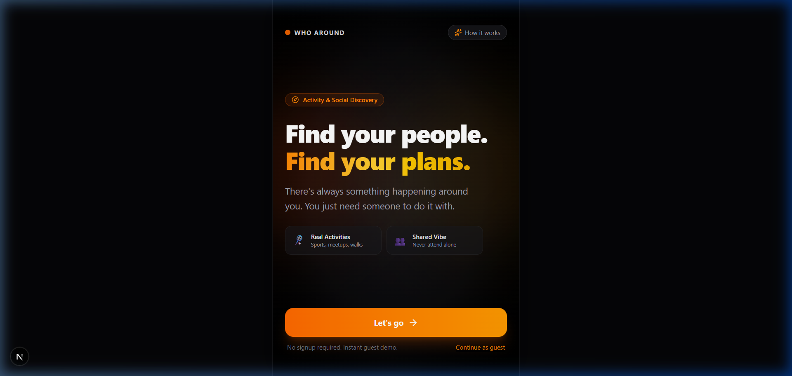
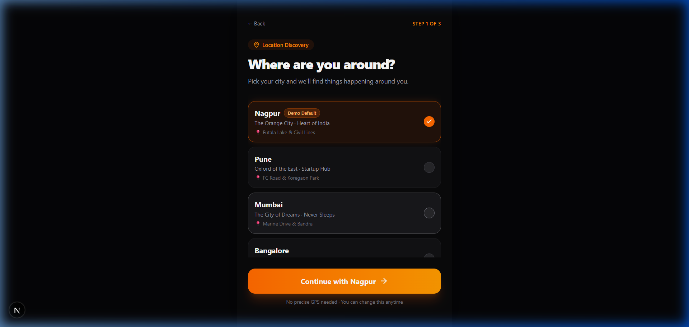
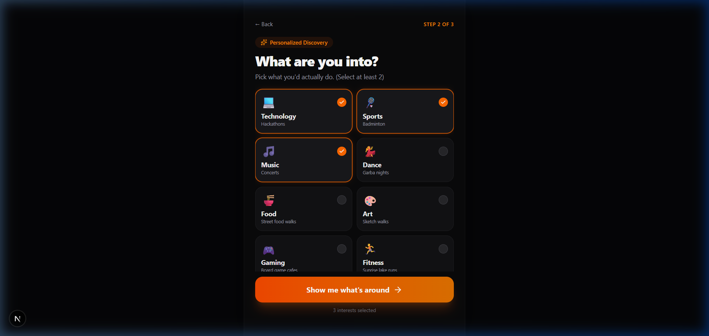
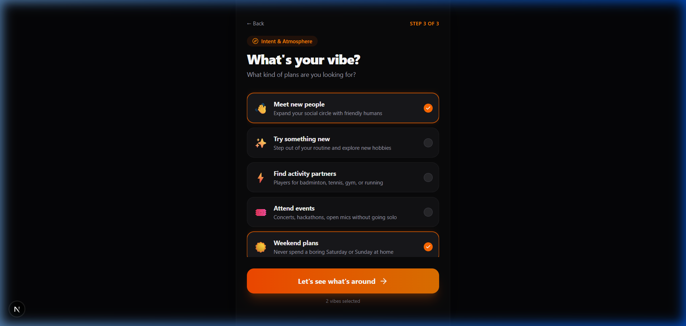
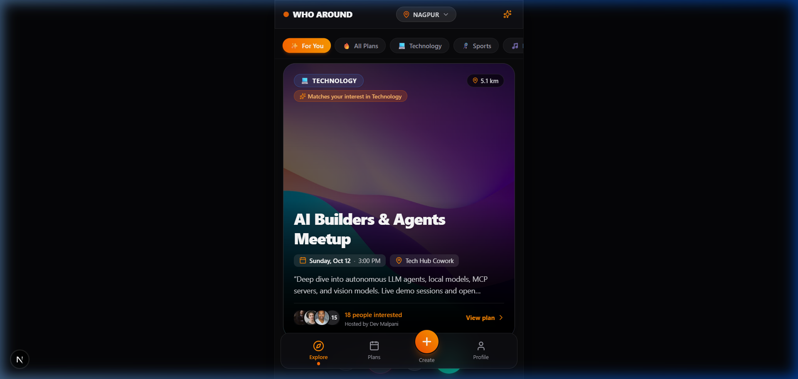
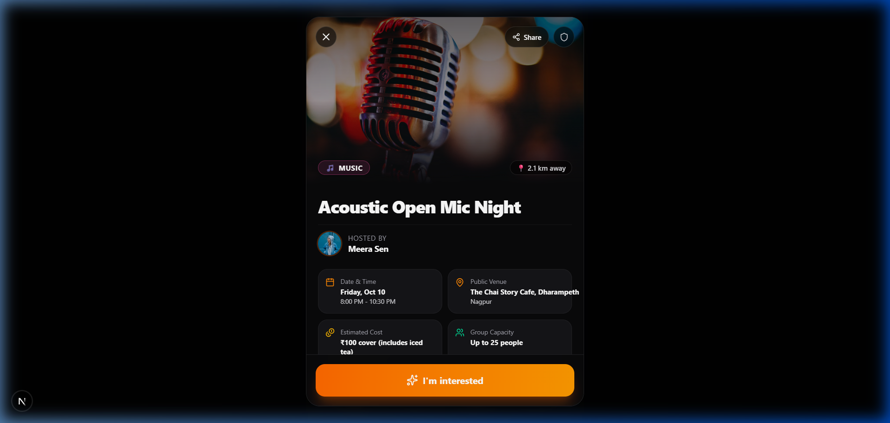
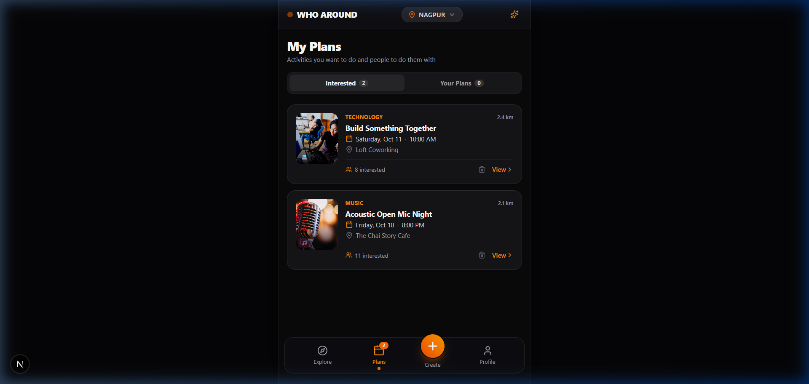
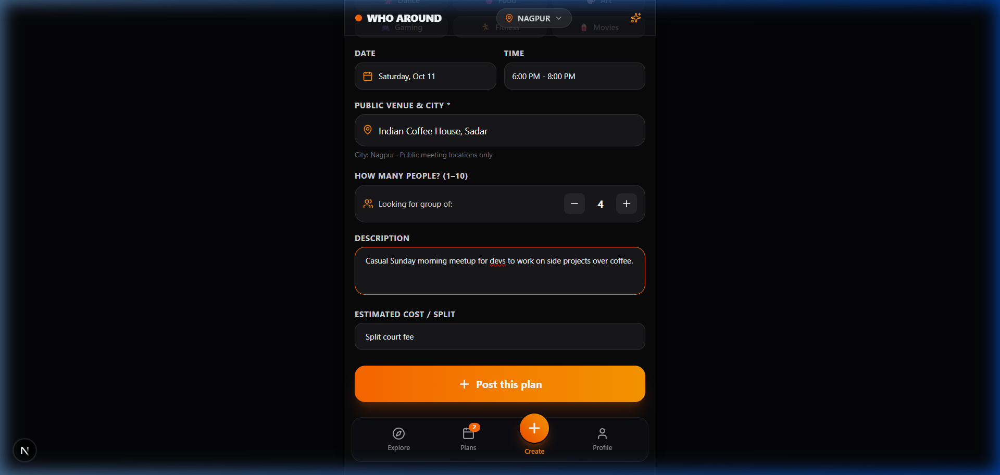
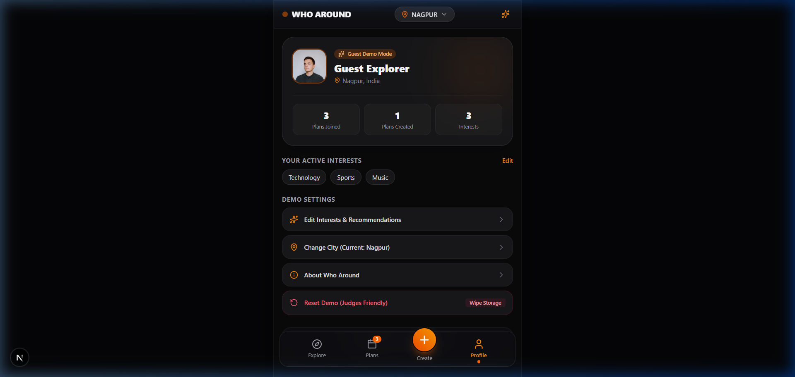

# WHO AROUND

### *"Find your people. Find your plans."*

[](https://whoaround03.vercel.app/)
[](https://nextjs.org/)
[](https://react.dev/)
[](https://tailwindcss.com/)

**Live URL:** [https://whoaround03.vercel.app/](https://whoaround03.vercel.app/)

---

## 💡 The Core Problem

In every city, there are students, interns, transplants, and working professionals who want to attend hackathons, play badminton, go to food walks, or check out open mics — but don't want to go alone.

The problem isn't always:  
> *"There is nothing to do."*

The problem is:  
> *"I don't have anyone to do it with."*

**Who Around** solves this by uniting **activity discovery + social matching + casual plan creation**.

---

## 🎯 Important Product Positioning

- **This is NOT a dating app.**
- Users swipe on **ACTIVITIES**, not people.
- The interaction model: **Activity → People Interested → Mutual Connection**.
- **NO AUTHENTICATION REQUIRED:** Zero signup, zero logins, zero phone/email friction. Judges and users immediately enter the experience.

---

## 📱 Visual Showcase & Product Tour

### 1. Onboarding Flow (Zero Friction)
| 1. Welcome & Splash | 2. City Selection | 3. Interest Selection |
| :---: | :---: | :---: |
|  |  |  |
| *"Find your people. Find your plans."* | Preselected Nagpur, Pune, Mumbai, Bangalore, etc. | Minimum 2 interests to personalize recommendations |

---

### 2. Matching & Discovery
| 4. Vibe Selection | 5. Fluid Swipe Stack | 6. Activity Details & Attendees |
| :---: | :---: | :---: |
|  |  |  |
| Match on intent: *"Meet new people"*, *"Weekend plans"* | Fluid physics, momentum projection & stamps | Social proof with mutual interests (*"You both like Technology"*) |

---

### 3. Plans, Creation & Profile
| 7. My Plans (Interested & Created) | 8. Make a Plan (Casual Host) | 9. Guest Profile & Reset Demo |
| :---: | :---: | :---: |
|  |  |  |
| Segmented tabs tracking joined & hosted plans | Quick presets (Badminton, Coffee & Code, Food Hop) | Instant **Reset Demo** button to wipe data for fresh demo |

---

## ⚡ Apple Design System & Fluid Motion

The UI is built according to **Apple Design Principles** (WWDC *Designing Fluid Interfaces*):

- **Momentum Projection:**
  $$\text{projectedEndpoint} = x_{\text{current}} + \frac{v_{\text{release}}}{1000} \cdot \frac{d}{1 - d} \quad (d \approx 0.998)$$
  Flicks project forward naturally rather than cutting off abruptly.
- **Spring Physics:** `damping: 22, stiffness: 280` on flick release; critically damped (`damping: 1.0`) on return.
- **Translucent Materials (`@apply` in `globals.css`):**
  - `.apple-glass` & `.apple-nav-dock`: Multi-layered frosted glass with light-catching edge borders.
  - `.apple-sheet`: Apple iOS bottom sheet modal with grab handles (`.apple-grab-handle`).
- **Instant Press Feedback:** `.apple-pressable` triggers instant pointer-down response (`active:scale-[0.97]` on 100ms ease-out) to kill tap latency.
- **Optical Typography:** SF Pro / system-ui with negative tracking on display titles (`apple-display-title`).

---

## 🧠 Personalization Algorithm

Activities are dynamically scored and prioritized using:
- **`+10` points** if the category matches user's selected interests.
- **`+5` points** for matching vibe intent.
- **`+3` points** if happening this weekend.
- **`+2` points** if nearby (< 3 km).
- **`+100` points** for user-created plans (always visible on top).

---

## 🛠️ Tech Stack

- **Framework:** [Next.js 16](https://nextjs.org/) (App Router, Turbopack)
- **Library:** [React 19](https://react.dev/)
- **Language:** [TypeScript](https://www.typescriptlang.org/)
- **Styling:** [Tailwind CSS v4](https://tailwindcss.com/) with custom Apple design tokens using `@apply`
- **Animation & Physics:** [Framer Motion](https://www.framer-motion.dev/)
- **Icons:** [Lucide React](https://lucide.dev/)
- **Effects:** [canvas-confetti](https://www.npmjs.com/package/canvas-confetti)
- **Storage:** Safe client-side `localStorage` wrapper (zero SSR hydration mismatches)
- **Deployment:** [Vercel](https://whoaround03.vercel.app/)

---

## 🚀 Getting Started

### Prerequisites

- Node.js 18+
- npm, pnpm, or yarn

### Installation

1. **Clone the repository:**
   ```bash
   git clone https://github.com/Aryan-Lade/WhoAround.git
   cd WhoAround
   ```

2. **Install dependencies:**
   ```bash
   npm install
   ```

3. **Start the local development server:**
   ```bash
   npm run dev
   ```

4. **Open in browser:**
   ```
   http://localhost:3000
   ```

---

## 🧪 Hackathon Demo Flow (for Judges)

1. Open [https://whoaround03.vercel.app/](https://whoaround03.vercel.app/).
2. Click **"Let's go"** on the Welcome screen (or review *"How it works"*).
3. Select **Nagpur** (default preselected) → click **"Continue with Nagpur"**.
4. Select **Technology** + **Sports** (and optionally **Music**) → click **"Show me what's around"**.
5. Select **"Meet new people"** + **"Weekend plans"** → click **"Let's see what's around"**.
6. Watch the animated matching radar transition into the **Explore Feed**.
7. Swipe left on a card (or click **✕ Skip**).
8. Swipe right on the next card (or click **💚 Interested**).
9. Tap a card or the **ℹ Info** button to open the **Activity Details Sheet**.
10. Notice **"People you might meet"** with mutual tags (*"You both like Technology"*).
11. Click **"I'm interested"** to trigger celebratory confetti and add the plan.
12. Tap the **Plans** tab to view your saved activity under **Interested**.
13. Tap the **+ Create** tab, click the **"Badminton doubles game"** preset, and tap **"Post this plan"**.
14. See the celebration modal: *"Your plan is live. You might not know them yet. But they might want to play too."*
15. Tap **"See who's around"** to find your created plan live at the top of the feed!
16. Visit the **Profile** tab and click **"Reset Demo"** to wipe storage and restart anytime.

---

## 📄 License

MIT License. Designed and built with ❤️ for the Hackathon.
